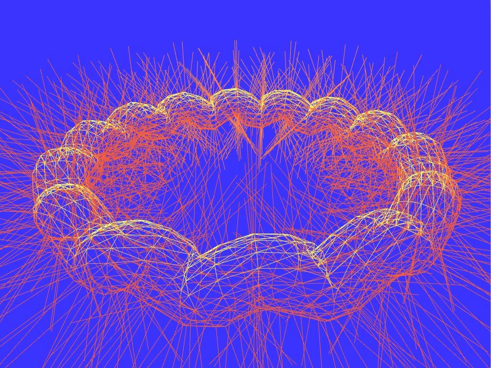
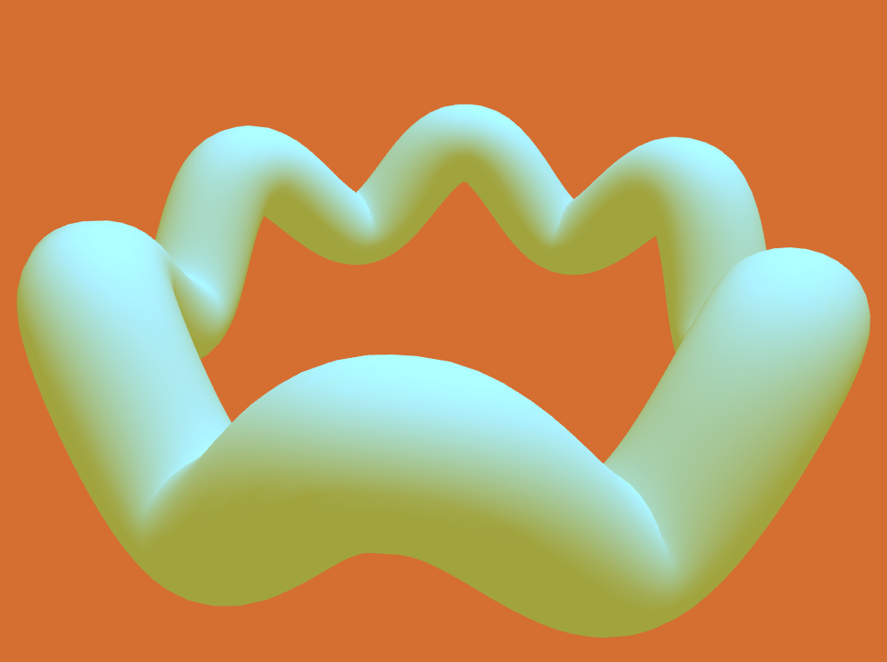
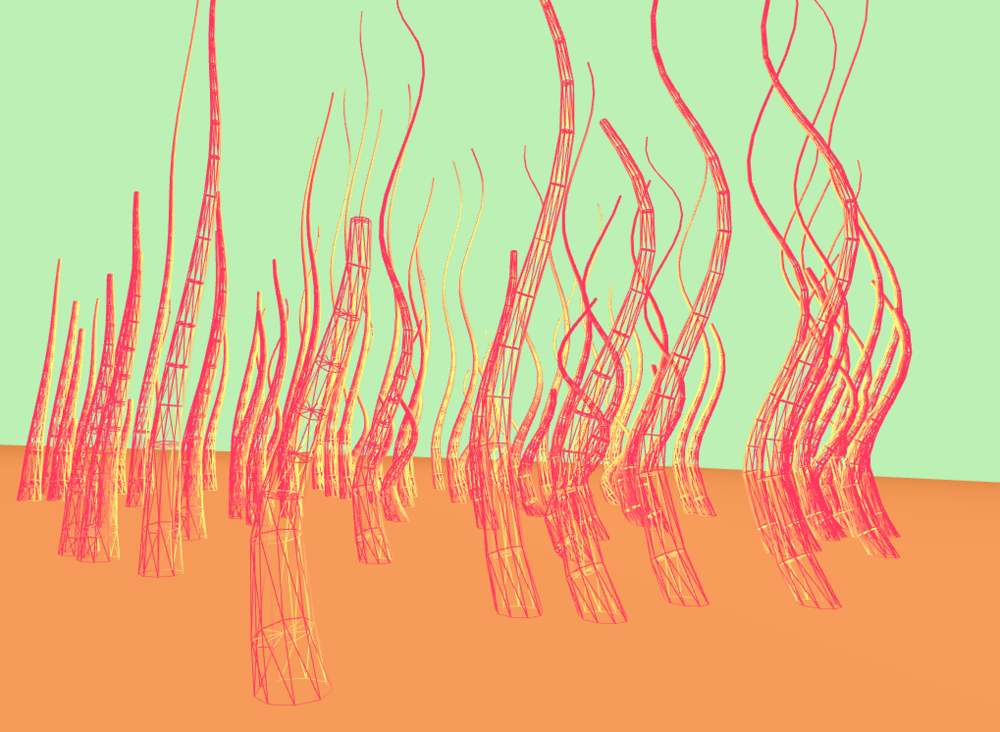

# ofxBranchesPrimitive
[](https://travis-ci.org/edap/ofxBranchesPrimitive)
[](https://ci.appveyor.com/project/edap/ofxbranchesprimitive)

This openFrameworks addon can be used to compose geometries that are made out of branches. As "branch" I mean a class that is initialized with a starting point and an end point, a quaternion that defines the initial orientation and an initial direction.

The desired geometry for each branch can be specified when merging the branches into the mesh. By default, this addon comes with a cylindric geometry that can be used to create tubular structures, as in the `example-circle-points` app. If you want to create your own geometry for the branches, have a look at the `example-branch` application, find the `ofxBranchCylinder::putIntoMesh` method and substitute it with your custom one.

### Usage

```cpp
//in your header file
ofxBranchesPrimitive tube;

void ofApp::setup(){
    int tot_points = 200;
    for (int i = 0; i <= tot_points; i++) {
      int radius = 40;
      float theta = 2.0f * 3.1415926f * float(i) / float(tot_points-1);
      float x = radius * cosf(theta);
      float z = radius * sinf(theta);
      point.x = x;
      point.z = z;
      tube.addVertex(point);
    }
    tube.build();
}

void ofApp::draw(){
    tube.draw();
}
```

### Options

By default, an `ofxBranchesPrimitive` uses a tubular geometry and it is initialized with these options:

```cpp
static const ofxBranchesPrimitiveOptions defaultOptions = {
    false, // cap, if the upper part of the cylinder composing a branch is closed or not
    5.0,   // radius, it defines how large is the branch
    16,    // resolution, it defines how many faces the cylinder will have. The minimum number is 3
    1,     // textureRepeat, it defines how many times a texture will repeat
    1.0    // radiusScale, it defines how much the radius of a branch should scale compared to the previous one
};
```

You can create you can pass your options during the initialization of the object or using the `setup(ofxBranchesPrimitiveOptions opt)` method. Have a look at the `example-scaled` application for more details about how to pass these options.

### Examples

*example-branch*


*example-circle-points*




*example-scaled*


