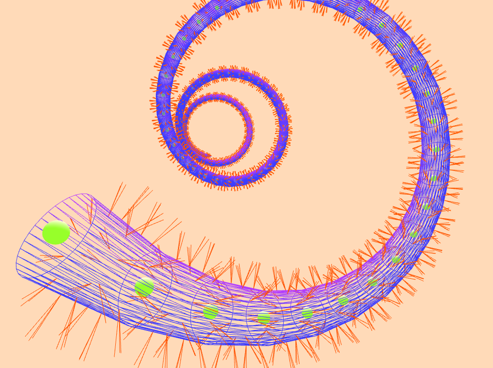

# ofxBranchesPrimitive

This openFrameworks addon can be used to compose geometries that are made out of branches. The desired geometry for each branch can be specified when merging the branches into the mesh. By default, this addon come with a cylindric geometry that can be used to create tubular structures.

### Examples

*example-branch*

